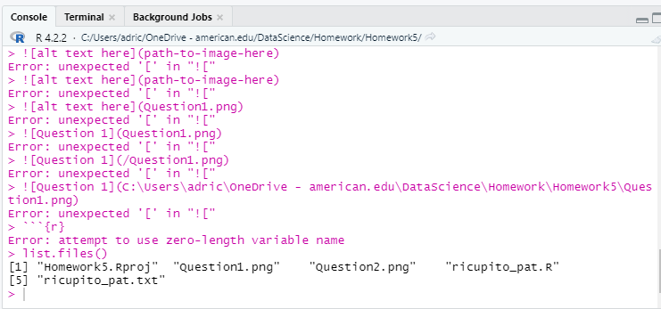

Question 1: 

Question 2:

GitHub screenshot: 

Code to create pat: 

Question 3: 

Question 4: 

Question 5: [url](https://github.com/aricupito/Homework5/tree/main)

Question 6: Top commit message is correct. 
